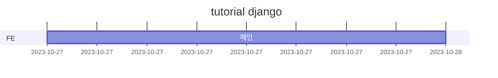

# openMarket

## 1. 목표와 기능

### 1.1 목표

### 1.2 기능

### 1.3 팀 구성
<table>
	<tr>
		<th>김현수</th>
	</tr>
 	<tr>
		<td></td>
	</tr>
</table>

## 2. 개발 환경 및 배포 URL
### 2.1 개발 환경
### 2.2 배포 URL

### 2.3 URL 구조(모놀리식)

### 2.4 URL 구조(마이크로식)

## 3. 요구사항 명세와 기능 명세

## 4. 프로젝트 구조와 개발 일정
### 4.1 프로젝트 구조
- 해당 프로젝트에서 폴더 트리 잘 다듬어 사용하세요. 필요하다면 주석을 달아주세요.
📦tutorial  
 ┣ 📂accounts  
 ┣ 📜README.md  

### 4.1 개발 일정(WBS)
* 아래 일정표는 머메이드로 작성했습니다.

## 5. 역할 분담

- 팀장 : 김현수
- FE : 김현수

## 6. 와이어프레임 / UI / BM

### 6.1 와이어프레임

### 6.2 화면 설계
- 화면은 gif파일로 업로드해주세요.
 
<table>
    <tbody>
        <tr>
            <td>메인</td>
        </tr>
    </tbody>
</table>

## 8. Architecture

## 9. 메인 기능

## 10. 에러와 에러 해결

## 10. 개발하며 느낀점
