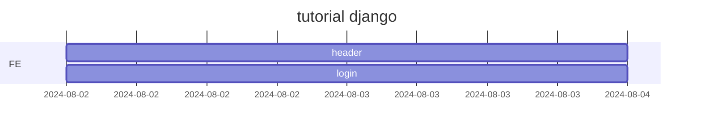

# openMarket

## 1. 목표와 기능

### 1.1 목표
- 판매자와 구매자를 구별하여 판매자가 상품을 등록, 판매하며 구매자는 해당 상품을 구매하는 서비스를 구현 합니다.

### 1.2 기능
- 판매자로 로그인 하여 상품을 등록, 수정 및 판매할 수 있습니다.
- 판매자는 상품 구매가 불가능합니다.
- 구매자가 오픈마켓에 등록되어 있는 상품의 세부사항을 확인할 수 있습니다.
- 구매자는 구매하고자 하는 상품을 장바구니에 담을 수 있습니다.
- 구매자는 장바구니에 담은 상품을 구매할 수 있습니다.

### 1.3 팀 구성
<table>
	<tr>
		<th>김현수</th>
	</tr>
 	<tr>
		<td></td>
	</tr>
</table>

## 2. 개발 환경 및 배포 URL

### 2.1 개발 환경
- 개발 환경
    - vite
- 배포 환경
    - GitHub pages

### 2.2 배포 URL
- https://gustn1029.github.io/openMarket/

### 2.3 URL 구조(모놀리식)

### 2.4 URL 구조(마이크로식)

## 3. 요구사항 명세와 기능 명세

## 4. 프로젝트 구조와 개발 일정
### 4.1 프로젝트 구조

📦openMarket   
 ┣ 📂css 
 ┃  ┣ style.css 
 ┃  ┣ login.css 
 ┣ 📂js 
 ┃  ┣ main.js 
 ┃  ┣ header.js 
 ┃  ┣ login.js 
 ┣ 📜index.html 
 ┣ 📜README.md   

### 4.1 개발 일정(WBS)
* 아래 일정표는 머메이드로 작성했습니다.

## 5. 역할 분담

- 팀장 : 김현수
- FE : 김현수

## 6. 와이어프레임 / UI / BM

### 6.1 와이어프레임

### 6.2 화면 설계
 
<table>
    <tbody>
        <tr>
            <td>메인</td>
        </tr>
    </tbody>
</table>

## 8. Architecture

## 9. 메인 기능

## 10. 에러와 에러 해결

## 10. 개발하며 느낀점
