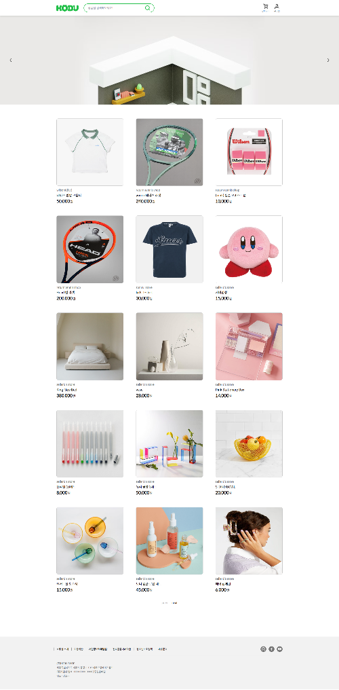

# openMarket

## 1. 목표와 기능

### 1.1 목표
- 판매자와 구매자를 구별하여 판매자가 상품을 등록, 판매하며 구매자는 해당 상품을 구매하는 서비스를 구현 합니다.

### 1.2 기능
- 판매자로 로그인 하여 상품을 등록, 수정 및 판매할 수 있습니다.
- 판매자는 상품 구매가 불가능합니다.
- 구매자가 오픈마켓에 등록되어 있는 상품의 세부사항을 확인할 수 있습니다.
- 구매자는 구매하고자 하는 상품을 장바구니에 담을 수 있습니다.
- 구매자는 장바구니에 담은 상품을 구매할 수 있습니다.

### 1.3 팀 구성
<table>
	<tr>
		<th>김현수</th>
	</tr>
</table>

## 2. 개발 환경 및 배포 URL

### 2.1 개발 환경
- 개발 환경
    - vite
- 배포 환경
    - GitHub pages

### 2.2 배포 URL
- https://gustn1029.github.io/openMarket/

### 2.3 URL 구조
|URL|페이지 설명|GET|POST|PUT|DELETE|로그인 권한|
|------|---|:---:|:---:|:---:|:---:|:---:|
|/|상품 목록|✔️|| | | |
|/login|로그인| |✔️| | | |
|/logout|로그아웃| |✔️| | | |
|/join|회원가입| |✔️| | | |
|/details|상품 상세 장바구니 담기 바로 구매|✔️   | ✔️ ✔️||| ✔️ ✔️|
|/cart|장바구니 상품 수량 변경 삭제 주문|✔️    |   ✔️| ✔️   |  ✔️  |✔️ ✔️ ✔️ ✔️|
|/order|주문/결제||✔️|||✔️|

## 3. 요구사항 명세와 기능 명세
- 로그인

- 로그아웃

- 회원가입

- 아이디 검증

- 사업자등록번호 검증

- 상품 목록

- 상품 상세

- 장바구니 담기

- 장바구니 물건 수량 수정

- 장바구니 물건 삭제

- 주문

## 4. 프로젝트 구조와 개발 일정
### 4.1 프로젝트 구조

📦openMarket   
 ┣ 📂css 
 ┃  ┣📜cart.css 
 ┃  ┣📜details.css 
 ┃  ┣📜join.css 
 ┃  ┣📜order.css 
 ┃  ┣📜sign.css 
 ┃  ┣📜style.css 
 ┣ 📂js 
 ┃  ┃ ┣📂components  
 ┃  ┃ ┃ ┣📂loading  
 ┃  ┃ ┃ ┃ ┣📜Loading.js  
 ┃  ┃ ┃ ┃ ┣📜loading.css  
 ┃  ┃ ┃ ┣📂modal  
 ┃  ┃ ┃ ┃ ┣📜modal.js  
 ┃  ┃ ┃ ┃ ┣📜modal.css  
 ┃  ┃ ┃ ErrorMessage.js  
 ┃  ┃ ┃ Home.js  
 ┃  ┃ ┃ LabelInput.js  
 ┃  ┣📜cart.js 
 ┃  ┣📜details.js 
 ┃  ┣📜header.js 
 ┃  ┣📜join.js 
 ┃  ┣📜login.js 
 ┃  ┣📜logout.js 
 ┃  ┣📜main.js 
 ┃  ┣📜order.js 
 ┃  ┣📜productList.js 
 ┣ 📜index.html 
 ┣ 📜README.md   

### 4.2 개발 일정(WBS)
* 아래 일정표는 머메이드로 작성했습니다.

## 5. 역할 분담

- 팀장 : 김현수
- FE : 김현수

## 6 화면 설계
 
<table>
    <tbody>
        <tr>
            <td>메인</td>
            <td></td>
        </tr>
        <tr>
            <td>로그인</td>
            <td></td>
        </tr>
        <tr>
            <td>회원가입</td>
            <td></td>
        </tr>
        <tr>
            <td>상세</td>
            <td></td>
        </tr>
        <tr>
            <td>장바구니</td>
            <td></td>
        </tr>
        <tr>
            <td>주문/결제</td>
            <td></td>
        </tr>
    </tbody>
</table>

## 7. 에러와 에러 해결
| **에러** | **에러 해결**| 
|----------|--------------|
| `로그아웃 시 일정 화면에서 빈화면으로 출력`| 로그아웃 시 루트 페이지로 이동하도록 함|
| `모달 클릭 시 계속 append 됨`| isModal 변수로 제어|
| `로그인 시 이전 페이지로 이동 안됨`| sessionStorage에 이전 페이지 해시 정보를 저장하여 이동|
| `헤더에 토큰 값 관련 401 에러`| 토큰 값 앞에 "JWT" 를 추가|

## 8. 개발하며 느낀점
vanillaJS로 SPA를 구현한 적이 강의를 들으면서 한번 따라한 뒤로 한번도 없었는데 구현 초기에 설계를 제대로 해야지만 개발하는 데에 문제가 없겠다 라는 것을 깨달을 수 있었습니다. 
짧은 기간에 구현한 프로젝트라 아쉬움이 많이 남지만 조금씩 고도화 해서 포트폴리오에 넣을 수 있도록 하겠습니다.
